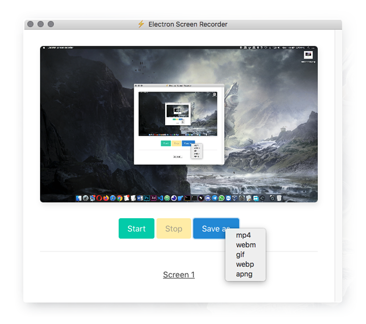

<h1 align="center">⚡ Electron Screen Recorder</h1>

  :vhs: A Desktop screen recorder app built using web technologies for Mac, Linux and Windows
  

> This project was made for learning purposes only and comes initially from [Fireship](https://www.youtube.com/channel/UCsBjURrPoezykLs9EqgamOA) YouTube channel with my own modifications

# Download
Available for Mac, Linux and Windows.

[Check the latest release](https://github.com/daltonmenezes/electron-screen-recorder/releases/latest)

# License
[MIT License](/LICENSE)
